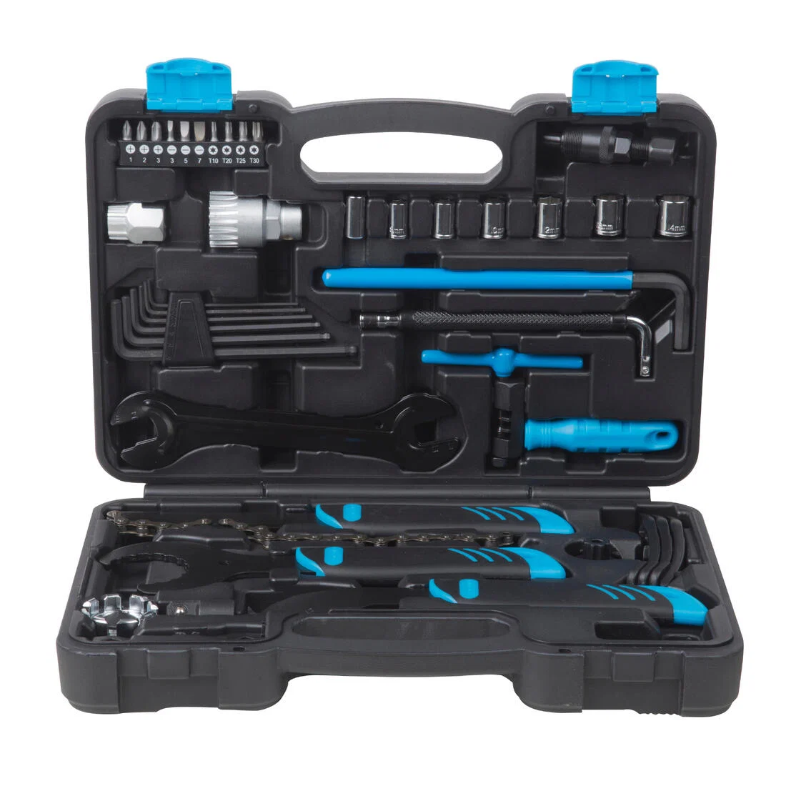
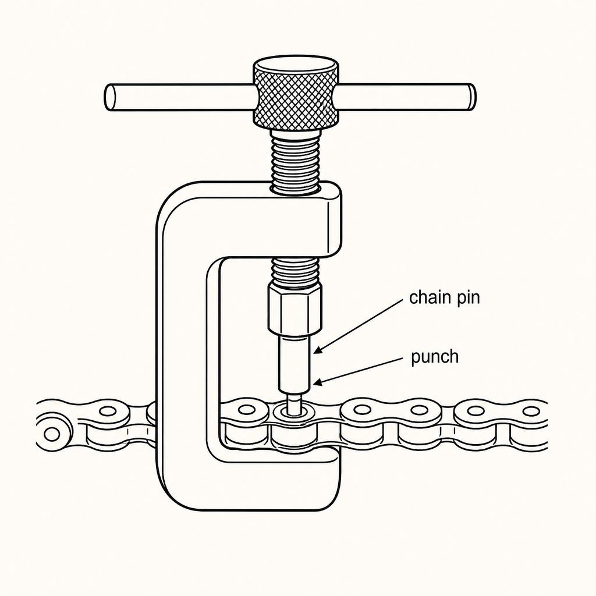
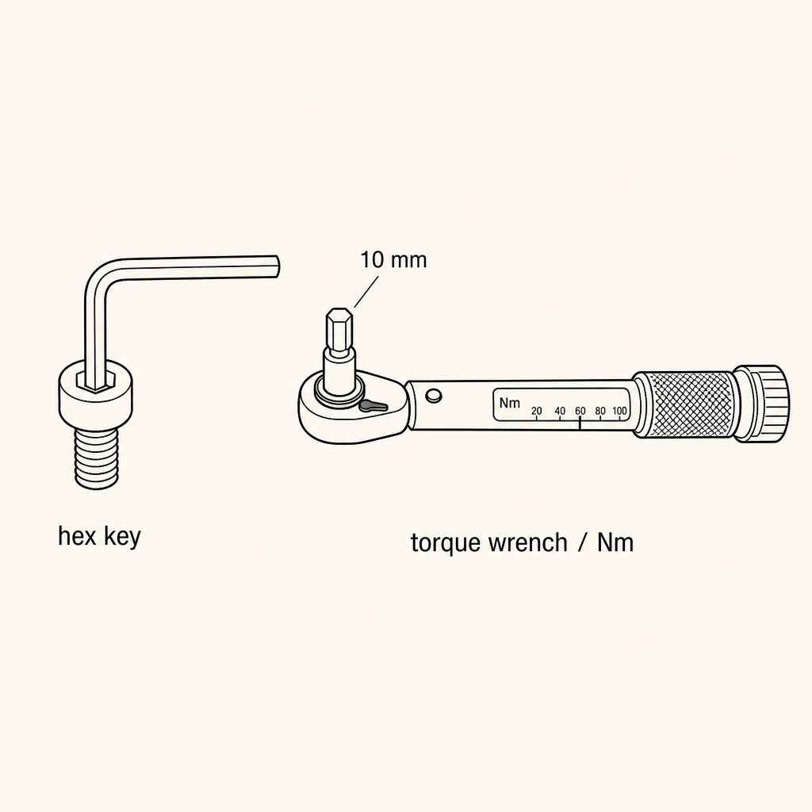
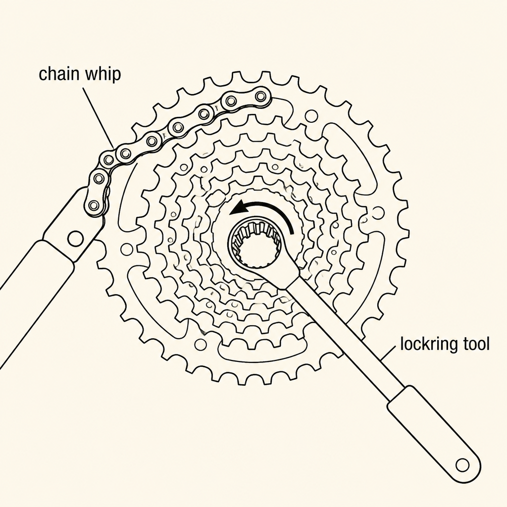
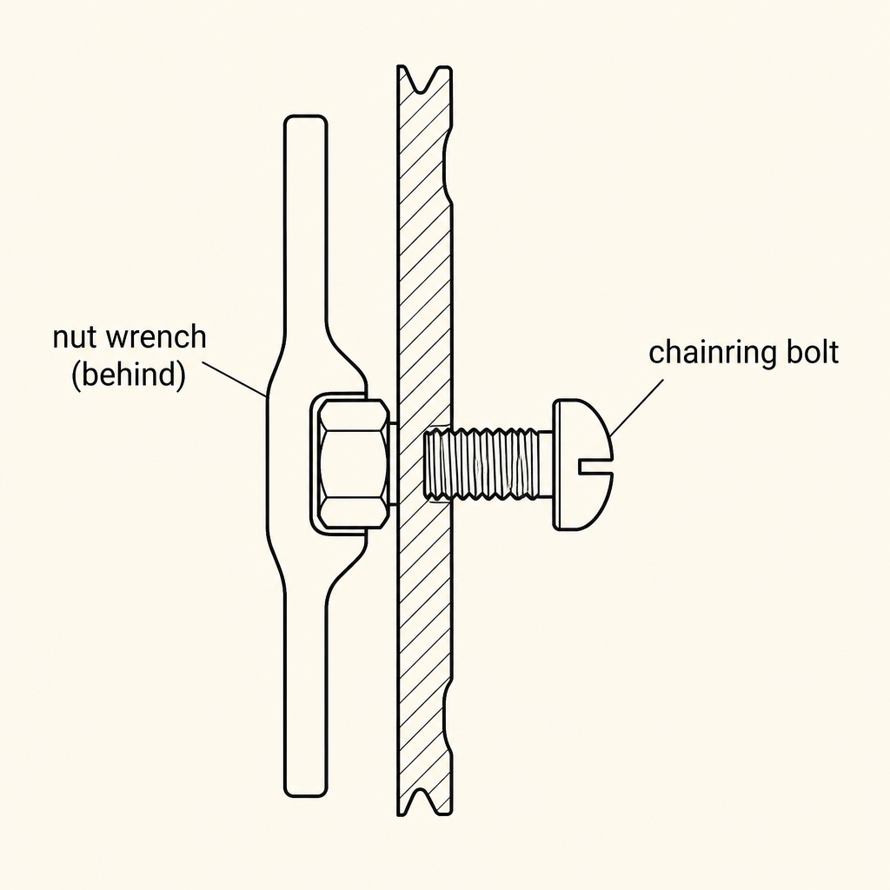

General anatomy notes and the toolkit required for routine maintenance.

## Essential toolkit {#sec-toolkit}

[{#fig-decathlon-900}](https://decathlon.re/products/boite-a-outils-velo-900)

@fig-decathlon-900 is the published contents of the Decathlon 900 box:
 (6–11 speed), hex keys, Torx T10–T30,
, Shimano HG ,
and a  nut wrench. Check the physical box
before buying extras — the listed hex set often stops at 8 mm.

::: {#fig-tool-mechanisms layout-ncol=2}

{#fig-tool-chain}

{#fig-tool-torque}

{#fig-tool-whip}

{#fig-tool-nut}

How the main workshop tools act, simplified.

:::

| Category | Tool | Typical use |
| --- | --- | --- |
| Chain | Chain tool (6–11 s) | Shorten or open the chain |
| Chain | Quick-link pliers | Open a quick-link |
| Fasteners | Hex keys | Derailleurs, chainrings, stems |
| Fasteners | Torx T30 | Some chainring bolts |
| Fasteners | 10 mm hex key / bit | FSA 30 mm crank bolt |
| Fasteners | Torque wrench (≥ 41 Nm) | Crank bolt at 38–41 Nm |
| Drivetrain | Chainring nut wrench | Hold nuts behind chainrings |
| Drivetrain | Chain whip + Shimano HG lockring tool | Cassette removal |
| Consumables | Bicycle grease | Axle, threads, chainring bolts |
| Consumables | Cable cutters | Only if a cable is frayed |

: Workshop tools grouped by job. {#tbl-toolkit}

Buy in addition: a **10 mm hex** and a 
that reaches **at least 41 Nm**. Quick-link pliers and grease are
comfort, not strict necessities.

### Torque wrench note

For an FSA 30 mm axle with a self-extracting bolt, FSA specifies a
**10 mm hex** and **38–41 Nm** with a calibrated wrench.

A compact 4–24 Nm wrench with a 10 mm bit is excellent for derailleurs
and chainring bolts but **does not reach crank-bolt torque**. Prefer a
3/8″ or 1/4″+3/8″ wrench covering roughly **5–50 Nm or 5–60 Nm** with
a **10 mm hex bit**.

## Bike anatomy (road) {#sec-anatomy}

```{mermaid}
%%| label: fig-bike-anatomy
%%| fig-cap: "Main components referenced in this part of the book."
flowchart TB
  subgraph frame [Frame & steering]
    H[Headset]
    F[Fork]
    ST[Seat tube]
  end
  subgraph drivetrain [Drivetrain]
    CS[Crankset / chainrings]
    BB[Bottom bracket]
    FD[Front derailleur]
    RD[Rear derailleur]
    CH[Chain]
    CAS[Cassette]
  end
  subgraph wheels [Wheels]
    WH[Hub]
    SP[Spokes]
    RM[Rim]
    TY[Tyre]
  end
  subgraph braking [Braking]
    BL[Brake levers]
    BC[Brake cables]
    BR[Brake calipers]
  end
  H --> F
  CS --> BB
  CS --> CH --> CAS
  FD --> CS
  RD --> CAS
  WH --> SP --> RM --> TY
  BL --> BC --> BR
```

## Required riding equipment {#sec-riding-kit}

- [ ] Helmet
- [ ] Front and rear lights
- [ ] Lock(s)
- [ ] Gloves
- [ ] Water bottles or hydration pack
- [ ] Mini pump or CO~2~ inflator
- [ ] Spare inner tube and tyre levers
- [ ] Multi-tool and quick-link
- [ ] Mudguards (wet weather)
