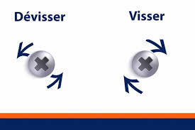

General anatomy notes, pedal fitting, and the toolkit required for
routine maintenance. 

**Minimum extra purchases:** 10 mm hex key/bit and a torque wrench to
**≥ 41 Nm**; add quick-link pliers and grease for convenience.

## Pedal orientation and thread direction {#sec-pedals}

The left pedal sits on the opposite side of the bottom bracket shell
(i.e. on your left when you mount the bike).

{#fig-screw-direction width=60%}

- **Fitting:** the right pedal tightens clockwise; the left pedal
  tightens anti-clockwise.
- **Removal:** the right pedal loosens anti-clockwise (the opposite of
  normal right-hand threads).

```{mermaid}
%%| label: fig-pedal-threads
%%| fig-cap: "Pedal thread directions (viewed from the outside of the crank)."
flowchart LR
  R[Right crank] -->|tighten| CW1[Clockwise]
  R -->|loosen| ACW1[Anti-clockwise]
  L[Left crank] -->|tighten| ACW2[Anti-clockwise]
  L -->|loosen| CW2[Clockwise]
```

## Essential toolkit {#sec-toolkit}

For a Shimano 105 triple 10-speed road bike (5700/5703 generation) with
an FSA Gossamer crankset, the following tools cover most jobs.

| Tool | Typical use | Status |
| --- | --- | --- |
| Chain tool (6–11 s) | Shorten or remove chain | In Decathlon 900 box |
| Hex keys | Derailleurs, chainrings | In box |
| Chainring nut wrench | Hold nuts behind chainrings | In box |
| Torx T30 | Some chainring bolts | In box |
| Chain whip + Shimano HG lockring tool | Cassette removal | In box |
| **10 mm hex key / bit** | FSA 30 mm crank bolt | **Add** |
| **Torque wrench (≥ 41 Nm)** | Crank bolt at 38–41 Nm | **Add** |
| Quick-link pliers | Chains with a master link | Recommended |
| Bicycle grease | Axle, threads, chainring bolts | Recommended |
| Cable cutters | Only if a cable is frayed | Optional |

Decathlon's published 900-box contents do not list a 10 mm hex key; their
separate hex set stops at 8 mm — **check your physical box before
buying**.

### Torque wrench note

For an FSA 30 mm axle with a self-extracting bolt, FSA specifies a
**10 mm hex** and **38–41 Nm** torque with a calibrated wrench.

A compact 4–24 Nm wrench with a 10 mm bit is excellent for derailleurs
and chainring bolts but **does not reach crank-bolt torque**. Prefer a
3/8″ or 1/4″+3/8″ wrench covering roughly **5–50 Nm or 5–60 Nm** with
a **10 mm hex bit**.

## Bike anatomy (road) {#sec-anatomy}

```{mermaid}
%%| label: fig-bike-anatomy
%%| fig-cap: "Main components referenced in this part of the book."
flowchart TB
  subgraph frame [Frame & steering]
    H[Headset]
    F[Fork]
    ST[Seat tube]
  end
  subgraph drivetrain [Drivetrain]
    CS[Crankset / chainrings]
    BB[Bottom bracket]
    FD[Front derailleur]
    RD[Rear derailleur]
    CH[Chain]
    CAS[Cassette]
  end
  subgraph wheels [Wheels]
    WH[Hub]
    SP[Spokes]
    RM[Rim]
    TY[Tyre]
  end
  subgraph braking [Braking]
    BL[Brake levers]
    BC[Brake cables]
    BR[Brake calipers]
  end
  H --> F
  CS --> BB
  CS --> CH --> CAS
  FD --> CS
  RD --> CAS
  WH --> SP --> RM --> TY
  BL --> BC --> BR
```

## Required riding equipment {#sec-riding-kit}

- [ ] Helmet
- [ ] Front and rear lights
- [ ] Lock(s)
- [ ] Gloves
- [ ] Water bottles or hydration pack
- [ ] Mini pump or CO~2~ inflator
- [ ] Spare inner tube and tyre levers
- [ ] Multi-tool and quick-link
- [ ] Mudguards (wet weather)
