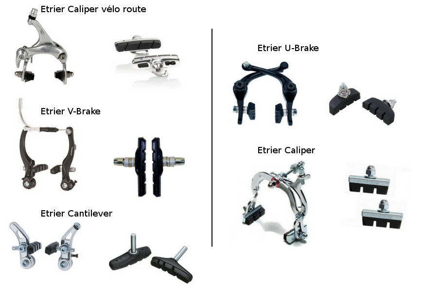
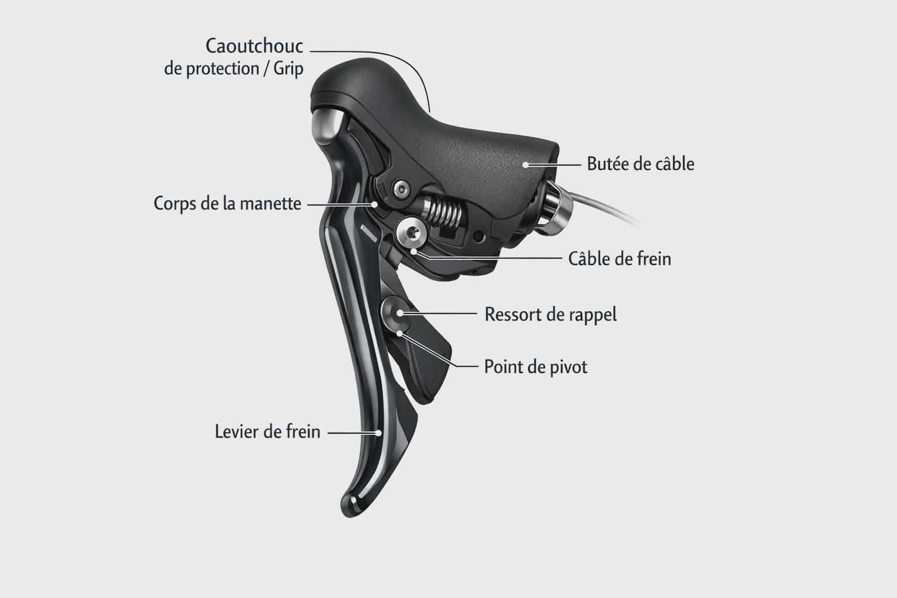

Brake types, inspection, and lever replacement notes.

## Brake caliper types {#sec-brake-types}

{#fig-brake-types width=85%}

Common road-bike families:

| Type | Where | Monitoring focus |
| --- | --- | --- |
| Rim (dual-pivot, side-pull) | Frame/fork bridges | Pad wear, rim surface, cable friction |
| Cantilever / V-brake | Older hybrids, CX | Pad alignment, straddle cable |
| Disc (mechanical or hydraulic) | Modern road, gravel | Rotor thickness, pad gap, fluid level |

: Common bicycle brake families. {#tbl-brake-types}

## How to monitor rim brakes {#sec-brake-monitor}

1. **Pad thickness** — replace before the metal holder contacts the rim.
2. **Pad alignment** — toe-in slightly at the leading edge; full contact
   without rubbing the tyre.
3. **Rim wear** — look for a wear groove disappearing or a concave profile.
4. **Cable and housing** — smooth lever travel; no fraying at the end.
5. **Quick test** — wheel spins freely off the stand; firm lever feel
   with ~2–3 cm travel before firm contact.

```{mermaid}
%%| label: fig-brake-inspection
%%| fig-cap: "Rim-brake inspection routine."
flowchart TD
  A[Lift bike / spin wheel] --> B{Wheel rubs?}
  B -->|Yes| C[Re-centre caliper or adjust pad height]
  B -->|No| D[Check pad thickness]
  D --> E{Metal visible?}
  E -->|Yes| F[Replace pads]
  E -->|No| G[Squeeze lever]
  G --> H{Firm & symmetric?}
  H -->|No| I[Check cable, housing, barrel adjuster]
  H -->|Yes| J[OK]
```

## Brake lever replacement {#sec-brake-levers}

Useful references when replacing or refurbishing 
levers:

::: {#fig-lever-video}



Lever replacement.

:::

::: {#fig-cable-lever-video}



Full cable and lever change.

:::

- [Shimano RSX lever rebuild](https://www.muzarde.com/reconditionner-une-poignee-sti-shimano-rsx-gauche/)
- [Shimano 105 ST-5600 diagram](https://lesmainsdansleguidon.fr/produit/paire-levier-manette-shimano-105-2x10vitesses-st-5600-flightdeck/)

{#fig-sti-diagram width=90%}

```{mermaid}
%%| label: fig-lever-swap
%%| fig-cap: "STI lever replacement outline."
flowchart TD
  A[Note cable routing] --> B[Shift to smallest sprockets]
  B --> C[Release brake cable]
  C --> D[Release gear cable]
  D --> E[Remove bar tape if needed]
  E --> F[Undo clamp bolt / remove lever]
  F --> G[Fit new lever]
  G --> H[Route cables]
  H --> I[Adjust brake bite point]
  I --> J[Re-index gears]
```
