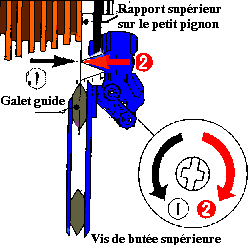
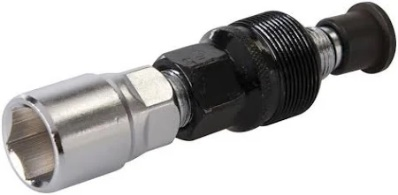
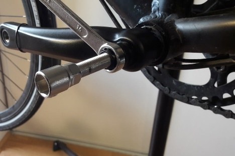
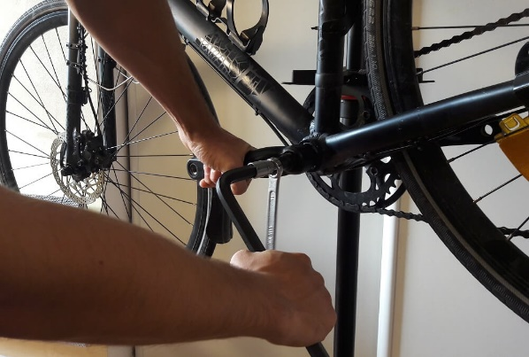
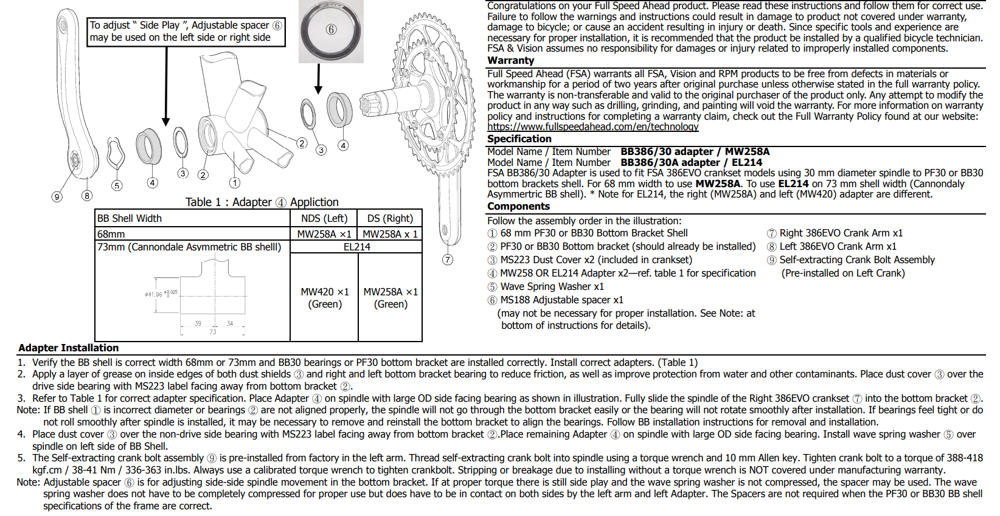
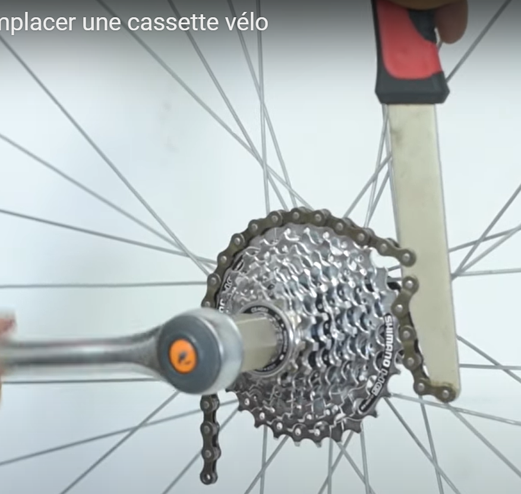
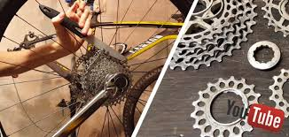
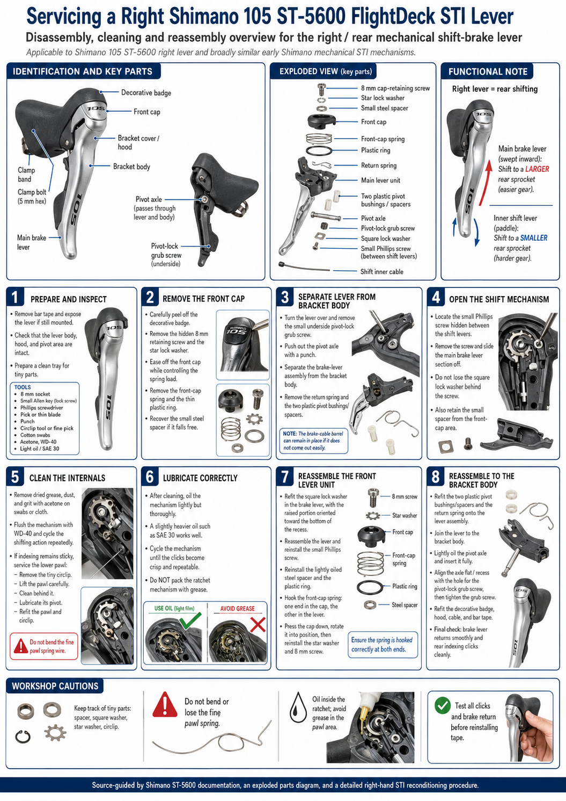
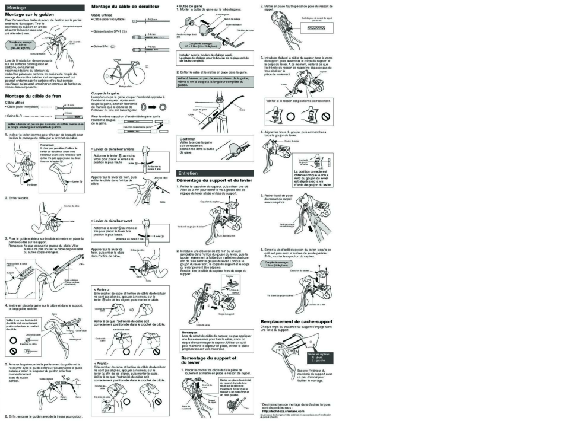
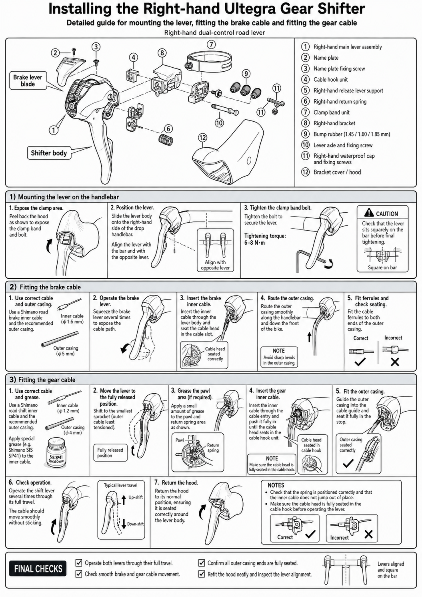

Derailleur adjustment, chain cleaning, and a chainring / rear-derailleur
replacement workflow for a Shimano 105 triple 10-speed bike.


## Front derailleur {#sec-gears-front}

Reference: [Citycle front derailleur guide](https://www.citycle.com/58444-conseils-et-astuces-pour-regler-un-derailleur-avant-de-velo/).

1. **Height and alignment** — outer cage plate ~2 mm above the big
   chainring teeth; cage parallel to the chainrings.
2. **Limit screws** — with the cable slack:
   - **L (low / inner)** — loosen to move toward the frame (e.g. if it
     sits on the middle ring instead of the inner); tighten to move
     outward if the chain drops off the inner ring.
   - **H (high / outer)** — sets the outer limit on the big ring.
3. **Cable tension** — leave ~2 turns of barrel-adjuster range; if
   shifts to larger rings are sluggish, increase cable tension; if the
   chain overshoots, reduce tension.

```{mermaid}
%%| label: fig-front-derailleur
%%| fig-cap: "Front derailleur adjustment order."
flowchart TD
  A[Slacken gear cable] --> B[Set L limit — inner ring]
  B --> C[Set H limit — outer ring]
  C --> D[Set cage height ~2 mm above big ring]
  D --> E[Clamp cable with barrel adjuster mid-range]
  E --> F[Test all three chainrings]
  F --> G{Clean shifts?}
  G -->|No| H[Fine-tune barrel adjuster]
  G -->|Yes| I[Done]
```

## Rear derailleur {#sec-gears-rear}

Reference: [VCMB rear derailleur guide](https://cyclo.vcmb.fr/la-vie-du-club/technique-mecanique/mecanique-velo/112-reglage-derailleur-arriere).

::: {#fig-rear-derailleur-video}



Rear derailleur adjustment walkthrough.

:::

1. Confirm the derailleur hanger is straight and the cage aligns with
   the sprockets.
2. **H limit (high gear, smallest sprocket)** — turning **out**
   (anti-clockwise) moves the upper jockey wheel outward; turning **in**
   moves it toward the frame.
3. **L limit (low gear, largest sprocket)** — the opposite sense to H:
   turning **in** moves outward; turning **out** moves toward the frame.
   (The L screw is sometimes called the "high stop" in shop jargon —
   confusing, but common.)
4. **Cable tension** — middle chainring, smallest sprocket; increase
   tension if upshifts are hesitant, decrease if the chain climbs too
   eagerly.
5. **B-tension screw** — sets gap between upper jockey wheel and
   largest sprocket.

{#fig-rd-h width=45%}
{#fig-rd-l width=45%}

```{mermaid}
%%| label: fig-rear-derailleur
%%| fig-cap: "Rear derailleur adjustment order."
flowchart TD
  A[Smallest sprocket — set H limit] --> B[Largest sprocket — set L limit]
  B --> C[Set B-tension screw]
  C --> D[Clamp cable on middle chainring / small sprocket]
  D --> E[Index through all 10 sprockets]
  E --> F{Skipping or noise?}
  F -->|Yes| G[Barrel adjuster ± quarter turn]
  F -->|No| H[Done]
```

## Chain cleaning {#sec-gears-chain}

1. Degrease (drivetrain cleaner or solvent).
2. Wash with warm water and washing-up liquid; remove the chain if
   heavily contaminated.
3. Dry thoroughly, then lubricate sparingly on each link; wipe excess.

Sources:

::: {#fig-chain-clean-video}



Chain cleaning and lubrication.

:::

- [Decathlon chain care](https://conseilsport.decathlon.fr/chaine-de-velo-comment-bien-la-nettoyer-et-lubrifier)

```{mermaid}
%%| label: fig-chain-clean
%%| fig-cap: "Chain cleaning workflow."
flowchart LR
  A[Degrease] --> B[Agitate / brush]
  B --> C[Rinse & dry]
  C --> D[Apply lube drop per link]
  D --> E[Wipe excess]
  E --> F[Rotate through gears]
```


## How to change the mechanical components {#sec-crank-removal}

### Pedal removal first

The left pedal sits on the opposite side of the bottom bracket shell
(i.e. on your left when you mount the bike).

{#fig-screw-direction width=60%}

- **Fitting:** the right pedal tightens clockwise; the left pedal
  tightens anti-clockwise.
- **Removal:** the right pedal loosens anti-clockwise (the opposite of
  normal right-hand threads).

```{mermaid}
%%| label: fig-pedal-threads
%%| fig-cap: "Pedal thread directions (viewed from the outside of the crank)."
flowchart LR
  R[Right crank] -->|tighten| CW1[Clockwise]
  R -->|loosen| ACW1[Anti-clockwise]
  L[Left crank] -->|tighten| ACW2[Anti-clockwise]
  L -->|loosen| CW2[Clockwise]
```

### Crankset removal second

Traditional square-taper or external-bearing systems use a crank
extractor; **FSA 30 mm self-extracting axles use a 10 mm hex in the
central bolt instead** — see @sec-cassette for sprocket clusters, and
the self-extracting procedure below for the FSA crank.

For extractor-type cranks:

1. Remove the chain.
2. Remove the retaining bolt at the base of the crank.
3. Fit the crank extractor; if stiff, back the extractor off slightly
   and tap with a mallet.
4. Tighten the extractor with a 14 mm spanner until the crank releases.
   Repeat on both sides, turning anti-clockwise.

{#fig-crank-extractor width=30%}
{#fig-crank-puller width=35%}
{#fig-crank-off width=40%}


#### Standard crankset removal

::: {#fig-road-crank-video}



Road crank removal with a classic extractor.

:::

```{mermaid}
%%| label: fig-crank-removal
%%| fig-cap: "Crank removal with a classic extractor (non self-extracting axles)."
flowchart TD
  A[Remove pedals] --> B[Remove chain from chainrings]
  B --> C[Undo crank retaining bolt]
  C --> D[Thread in crank extractor]
  D --> E[Tighten extractor body against crank]
  E --> F[Turn extractor bolt anti-clockwise]
  F --> G{Crank released?}
  G -->|No| E
  G -->|Yes| H[Repeat other side]
```
#### Self-extracting crankset removal with a 10 mm hex key

::: {#fig-self-extracting-crankset-removal}



Self-extracting crankset removal / installation. FSA Gossamer BB30.

:::

In @fig-self-extracting-crankset-removal, the procedure for removing a
crankset with a self-extracting axle (10 mm hex key) is shown.

For the manufacturer's PDF, refer to @fig-manual-crankset-removal.

[{#fig-manual-crankset-removal}](https://shop.fullspeedahead.com/en/files/index/download/id/e78fa6c7be9b9e63ddec816cb672dfb1735/)


### Cassette or freewheel {#sec-cassette}

Two incompatible rear clusters exist. Both let you coast, but they
**fix to the hub differently** and need **different removers**. Summary
from [Le Cyclo — freewheel and cassette](https://www.lecyclo.com/blogs/conseils/roue-libre-cassette-velo).

| | Freewheel (roue libre) | Cassette |
| --- | --- | --- |
| Hub | Threaded | Splined freehub body |
| Ratchet | Inside the cluster | Inside the hub |
| Speeds | 1–8 (never more than 8) | 7–12 |
| Typical bikes | Pre-1980s, city, BMX, singlespeed | Modern road and mountain |
| Remover | Freewheel remover (démonte-roue-libre) | Shimano HG lockring tool |
| Hold still with | Chain whip | Chain whip |

: Mechanical differences between a threaded freewheel and a cassette. {#tbl-cassette-vs-freewheel}

**Visual check** (wheel off, turn the sprockets by hand):

- **Freewheel:** a ring between the axle and the smallest sprocket
  **stays still** while the sprockets spin. The cluster is one block.
- **Cassette:** the **whole stack turns together**; nothing stays
  fixed next to the axle. Nine sprockets or more is always a cassette.

```{mermaid}
%%| label: fig-cassette-or-freewheel
%%| fig-cap: "How to tell a threaded freewheel from a cassette."
flowchart TD
  A[Rear wheel off] --> B{More than 8 sprockets?}
  B -->|Yes| C[Cassette]
  B -->|No| D[Spin the sprockets]
  D --> E{Fixed ring next to the axle?}
  E -->|Yes — inner stays still| F[Threaded freewheel]
  E -->|No — whole stack turns| C
```

#### Removing a cassette

The sprockets slide off the freehub body after the lockring is undone.
The Decathlon 900 box already has the whip and the HG lockring tool.

::: {#fig-cassette-video}



Cassette removal on a Shimano HG freehub.

:::

1. Remove the rear wheel and the quick-release or thru-axle.
2. Wrap the  on the largest sprocket to
   stop the cassette turning.
3. Seat the  in the lockring.
4. Turn the lockring **anti-clockwise**.
5. Slide the sprockets off the splines (note the wider spline gap —
   it keys the orientation).
6. Clean the freehub body before refitting; tighten the new lockring
   **clockwise**.

{#fig-chain-whip width=45%}
{#fig-cassette-off width=45%}

```{mermaid}
%%| label: fig-cassette-removal
%%| fig-cap: "Cassette removal on a Shimano HG freehub."
flowchart LR
  A[Remove rear wheel] --> B[Remove quick-release / thru-axle]
  B --> C[Wrap chain whip on largest sprocket]
  C --> D[Insert HG lockring tool]
  D --> E[Turn lockring anti-clockwise]
  E --> F[Slide cassette off splines]
  F --> G[Clean freehub body]
```

#### Removing a freewheel

The whole body **unscrews from the hub**. A cassette lockring tool will
**not** fit: you need a freewheel remover whose splines (or two prongs)
match that brand.

1. Same as above: wheel off, chain whip on the largest sprocket.
2. Seat the **freewheel remover** fully in the centre.
3. Turn **anti-clockwise**. The first break of thread is often very
   tight (pedalling has been tightening it for years).
4. Once loose, unscrew the whole body by hand.

Refit by starting the thread **by hand, clockwise**, square to the hub,
then finish with the remover or by pedalling. Cross-threading ruins the
hub.

```{mermaid}
%%| label: fig-freewheel-removal
%%| fig-cap: "Threaded freewheel removal."
flowchart LR
  A[Remove rear wheel] --> B[Chain whip on large sprocket]
  B --> C[Seat freewheel remover]
  C --> D[Turn anti-clockwise]
  D --> E[Unscrew whole body]
```

## Summary infographic

```{mermaid}
%%| label: fig-chainring-swap
%%| fig-cap: "Chainring and rear-derailleur replacement (keep shifters, cables, FD)."
flowchart TD
  A[Chain on small ring + small sprocket] --> B[Remove chain]
  B --> C[Remove rear derailleur — note cable clamp only]
  C --> D[Mount new RD — leave cable detached]
  D --> E[Set H limit before cabling]
  E --> F[Remove crank with 10 mm hex — self-extracting FSA]
  F --> G[Photograph washer stack]
  G --> H[Swap 52/39/30 chainrings on bench]
  H --> I[Light grease on bolt threads]
  I --> J[Reinstall crank — torque 38–41 Nm]
  J --> K[Adjust rear derailleur cable + limits + B screw]
  K --> L[Fit new 10-speed chain to old length]
  L --> M[Static shifts then test ride]
```

Step-by-step:

1. **Remove the chain** — quick-link pliers if fitted; otherwise use the
   chain tool from the 900 box.
2. **Remove the rear derailleur** — slacken the cable pinch bolt only;
   no need to pull the inner wire from the shifter. Unbolt from the
   hanger (**8–10 Nm** on refit).
3. **Set the H limit** on the new derailleur before attaching the cable.
4. **Remove the FSA crank** — left side: **10 mm hex** in the central
   self-extracting bolt, turn anti-clockwise. Do not remove the outer
   retaining ring; it is part of the extraction mechanism.
5. **Photograph washers** — especially the wave washer; keep the BB30
   bearings in the frame.
6. **Replace chainrings** on the bench — use the chainring nut tool;
   orient markings and anti-drop pin on the outer ring behind the crank
   arm.
7. **Grease bolt threads lightly** — follow torque specs supplied with
   the new rings.
8. **Reinstall the crank** — restore washers in the original order;
   torque the 30 mm axle bolt to **38–41 Nm** with a calibrated wrench.
9. **Adjust the rear derailleur** — H limit, cable tension, L limit,
   B-tension.
10. **Fit a new 10-speed chain** — match the old link count if the
    previous length was correct; respect directional markings.
11. **Test** — the front derailleur should need little change if
    tooth counts stay 52/39/30.

## Zoom on Ultegra gear shift {#sec-ultegra-shift}

The right-hand  lever indexes the rear derailleur;
the left indexes the front. These notes cover a 10-speed Shimano lever
of the same generation as the 105 triple above. Bar-clamp and cable
work overlap with @sec-brake-levers.

{#fig-ultegra-teardown width=90%}

@fig-ultegra-teardown is a workshop teardown of a right-hand 105
ST-5600 FlightDeck lever. The ratchet and pawls are the same 10-speed
STI architecture as Ultegra of that era. Open the lever only if
indexing feels gritty after a cable change:

- Keep the tiny spacers, star washer, and square lock washer together.
- Clean grit with solvent; **do not bend the fine pawl spring**.
- Relubricate the ratchet with a **light oil film**. Grease packs the
  pawls and makes shifts sticky.

Refit the hood and test every click plus brake return before wrapping
the bar.

{#fig-ultegra-install-parts width=90%}

@fig-ultegra-install-parts is the parts legend and install sequence.
Mount the lever before cabling:

1. Peel the hood back to expose the clamp band.
2. Align both levers on the drops, then torque the clamp bolt to
   **6–8 Nm**. Check that the body sits square on the bar before the
   final tighten.
3. Fit the **brake** inner first (**1.6 mm** inner, **5 mm** outer),
   with the nipple fully seated in the lever.
4. Shift to the smallest sprocket, grease the pawl area with Shimano
   SIS SP41, then fit the **gear** inner (**1.2 mm** inner, **4 mm**
   outer) into the cable hook unit.

{#fig-ultegra-install width=90%}

@fig-ultegra-install is a compact sheet of the same three blocks:
clamp, brake cable, gear cable. Use it at the bench as a checklist;
use @fig-ultegra-install-parts when a part name or seating diagram is
unclear.

Before wrapping the bar, confirm:

- both levers travel fully, with clean upshifts and downshifts;
- inners run freely and every outer-casing end is seated;
- the hoods sit neatly and the levers are square to each other.

See [@fig-ultegra-teardown; @fig-ultegra-install-parts; @fig-ultegra-install]
for the teardown, the exploded install diagram, and the compact
workshop sheet.
