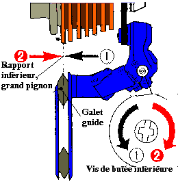

Derailleur adjustment, chain cleaning, and a chainring / rear-derailleur
replacement workflow for a Shimano 105 triple 10-speed bike.


## Front derailleur {#sec-gears-front}

Reference: [Citycle front derailleur guide](https://www.citycle.com/58444-conseils-et-astuces-pour-regler-un-derailleur-avant-de-velo/).

1. **Height and alignment** — outer cage plate ~2 mm above the big
   chainring teeth; cage parallel to the chainrings.
2. **Limit screws** — with the cable slack:
   - **L (low / inner)** — loosen to move toward the frame (e.g. if it
     sits on the middle ring instead of the inner); tighten to move
     outward if the chain drops off the inner ring.
   - **H (high / outer)** — sets the outer limit on the big ring.
3. **Cable tension** — leave ~2 turns of barrel-adjuster range; if
   shifts to larger rings are sluggish, increase cable tension; if the
   chain overshoots, reduce tension.

```{mermaid}
%%| label: fig-front-derailleur
%%| fig-cap: "Front derailleur adjustment order."
flowchart TD
  A[Slacken gear cable] --> B[Set L limit — inner ring]
  B --> C[Set H limit — outer ring]
  C --> D[Set cage height ~2 mm above big ring]
  D --> E[Clamp cable with barrel adjuster mid-range]
  E --> F[Test all three chainrings]
  F --> G{Clean shifts?}
  G -->|No| H[Fine-tune barrel adjuster]
  G -->|Yes| I[Done]
```

## Rear derailleur {#sec-gears-rear}

Reference: [VCMB rear derailleur guide](https://cyclo.vcmb.fr/la-vie-du-club/technique-mecanique/mecanique-velo/112-reglage-derailleur-arriere)
and [video walkthrough](https://youtu.be/VIJnvfEM63M).

1. Confirm the derailleur hanger is straight and the cage aligns with
   the sprockets.
2. **H limit (high gear, smallest sprocket)** — turning **out**
   (anti-clockwise) moves the upper jockey wheel outward; turning **in**
   moves it toward the frame.
3. **L limit (low gear, largest sprocket)** — the opposite sense to H:
   turning **in** moves outward; turning **out** moves toward the frame.
   (The L screw is sometimes called the "high stop" in shop jargon —
   confusing, but common.)
4. **Cable tension** — middle chainring, smallest sprocket; increase
   tension if upshifts are hesitant, decrease if the chain climbs too
   eagerly.
5. **B-tension screw** — sets gap between upper jockey wheel and
   largest sprocket.

::: {.content-visible when-format="html"}
{width=45%}
{width=45%}
:::

::: {.content-visible when-format="pdf"}
{width=45%}
{width=45%}
:::

```{mermaid}
%%| label: fig-rear-derailleur
%%| fig-cap: "Rear derailleur adjustment order."
flowchart TD
  A[Smallest sprocket — set H limit] --> B[Largest sprocket — set L limit]
  B --> C[Set B-tension screw]
  C --> D[Clamp cable on middle chainring / small sprocket]
  D --> E[Index through all 10 sprockets]
  E --> F{Skipping or noise?}
  F -->|Yes| G[Barrel adjuster ± quarter turn]
  F -->|No| H[Done]
```

## Chain cleaning {#sec-gears-chain}

1. Degrease (drivetrain cleaner or solvent).
2. Wash with warm water and washing-up liquid; remove the chain if
   heavily contaminated.
3. Dry thoroughly, then lubricate sparingly on each link; wipe excess.

Sources:

- [YouTube chain clean](https://www.youtube.com/watch?v=gvM-egPjf1Q&t=63s)
- [Decathlon chain care](https://conseilsport.decathlon.fr/chaine-de-velo-comment-bien-la-nettoyer-et-lubrifier)

```{mermaid}
%%| label: fig-chain-clean
%%| fig-cap: "Chain cleaning workflow."
flowchart LR
  A[Degrease] --> B[Agitate / brush]
  B --> C[Rinse & dry]
  C --> D[Apply lube drop per link]
  D --> E[Wipe excess]
  E --> F[Rotate through gears]
```

## Chainring and rear-derailleur replacement {#sec-gears-chainrings}

Notes for an **FSA Gossamer triple 52/39/30** (five-arm: 130 mm BCD
outer/middle, 74 mm BCD inner), **175 mm cranks**, **9/10-speed**
chain, with **Shimano 105 ST-5703 / FD-5703** shifters.

Compatible rear derailleur: **Shimano 105 RD-5701-GS** (preferred) or
**Tiagra RD-4601-GS**. Do **not** fit a Deore M6000 10-speed derailleur
— cable pull differs from 5700-generation road levers.

**Before ordering:** confirm the largest cassette sprocket (officially
25–30 teeth for RD-5701-GS). Examples `11-28`, `12-28`, `12-30` are
fine; `11-32` needs checking.

### Suggested chainring parts

| Ring | Spec |
| --- | --- |
| Outer 52 | TA Spécialités Alizé, 130 BCD, 5-arm, 9/10 s |
| Middle 39 | TA Spécialités Alizé, 130 BCD, 5-arm, 9/10 s |
| Inner 30 | TA Spécialités Zelito, 74 BCD, 5-arm, triple 9/10 s |

### Replacement procedure

```{mermaid}
%%| label: fig-chainring-swap
%%| fig-cap: "Chainring and rear-derailleur replacement (keep shifters, cables, FD)."
flowchart TD
  A[Chain on small ring + small sprocket] --> B[Remove chain]
  B --> C[Remove rear derailleur — note cable clamp only]
  C --> D[Mount new RD — leave cable detached]
  D --> E[Set H limit before cabling]
  E --> F[Remove crank with 10 mm hex — self-extracting FSA]
  F --> G[Photograph washer stack]
  G --> H[Swap 52/39/30 chainrings on bench]
  H --> I[Light grease on bolt threads]
  I --> J[Reinstall crank — torque 38–41 Nm]
  J --> K[Adjust rear derailleur cable + limits + B screw]
  K --> L[Fit new 10-speed chain to old length]
  L --> M[Static shifts then test ride]
```

Step-by-step:

1. **Remove the chain** — quick-link pliers if fitted; otherwise use the
   chain tool from the 900 box.
2. **Remove the rear derailleur** — slacken the cable pinch bolt only;
   no need to pull the inner wire from the shifter. Unbolt from the
   hanger (**8–10 Nm** on refit).
3. **Set the H limit** on the new derailleur before attaching the cable.
4. **Remove the FSA crank** — left side: **10 mm hex** in the central
   self-extracting bolt, turn anti-clockwise. Do not remove the outer
   retaining ring; it is part of the extraction mechanism.
5. **Photograph washers** — especially the wave washer; keep the BB30
   bearings in the frame.
6. **Replace chainrings** on the bench — use the chainring nut tool;
   orient markings and anti-drop pin on the outer ring behind the crank
   arm.
7. **Grease bolt threads lightly** — follow torque specs supplied with
   the new rings.
8. **Reinstall the crank** — restore washers in the original order;
   torque the 30 mm axle bolt to **38–41 Nm** with a calibrated wrench.
9. **Adjust the rear derailleur** — H limit, cable tension, L limit,
   B-tension.
10. **Fit a new 10-speed chain** — match the old link count if the
    previous length was correct; respect directional markings.
11. **Test** — the front derailleur should need little change if
    tooth counts stay 52/39/30.

### Cassette wear warning

A new chain on a heavily worn cassette can skip under load. If skipping
persists on one or two sprockets despite correct adjustment, replace the
cassette — the 900 box already includes the HG lockring tool and chain
whip.


## Crankset removal (after pedals) {#sec-crank-removal}

Traditional square-taper or external-bearing systems use a crank
extractor; **FSA 30 mm self-extracting axles use a 10 mm hex in the
central bolt instead** — see @sec-gears-chainrings for the full
chainring-replacement workflow.

For extractor-type cranks:

1. Remove the chain.
2. Remove the retaining bolt at the base of the crank.
3. Fit the crank extractor; if stiff, back the extractor off slightly
   and tap with a mallet.
4. Tighten the extractor with a 14 mm spanner until the crank releases.
   Repeat on both sides, turning anti-clockwise.

{width=30%}
{width=35%}
{width=40%}

Reference videos:

- [Road crank removal](https://youtu.be/qytVJYF0-Sk)

```{mermaid}
%%| label: fig-crank-removal
%%| fig-cap: "Crank removal with a classic extractor (non self-extracting axles)."
flowchart TD
  A[Remove pedals] --> B[Remove chain from chainrings]
  B --> C[Undo crank retaining bolt]
  C --> D[Thread in crank extractor]
  D --> E[Tighten extractor body against crank]
  E --> F[Turn extractor bolt anti-clockwise]
  F --> G{Crank released?}
  G -->|No| E
  G -->|Yes| H[Repeat other side]
```
### Self Extracting Crankset Removal with a 10 mm hex key

::: {#fig-self-extracting-crankset-removal}



Self-extracting crankset removal / installation. FSA Gossamer BB30.

:::

In @fig-self-extracting-crankset-removal, the procedure for removing a
crankset with a self-extracting axle (10 mm hex key) is shown.

For the manufacturer's PDF, refer to @fig-manual-crankset-removal.

[{#fig-manual-crankset-removal}](https://shop.fullspeedahead.com/en/files/index/download/id/e78fa6c7be9b9e63ddec816cb672dfb1735/)
