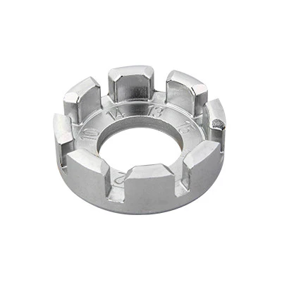
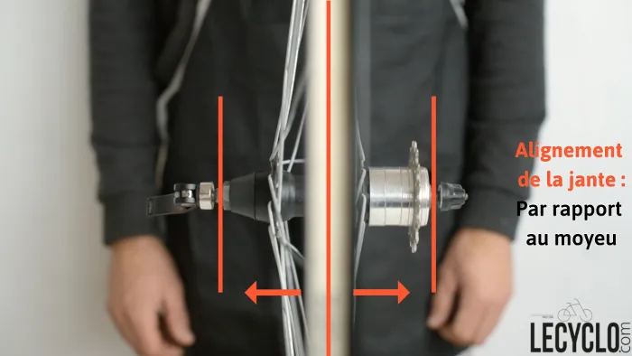
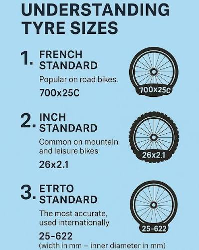
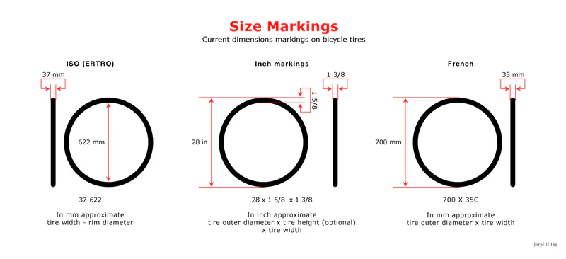
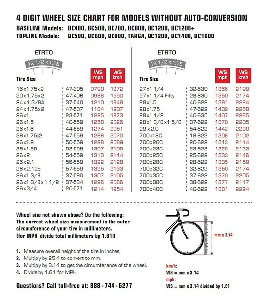

Wheel truing and tyre basics.

## Wheel truing {#sec-truing}

### Tools

{#fig-spoke-wrench width=15%}

-  (correct size for your nipples)
- Truing stand or frame as a guide
- Dish gauge (optional) — checks rim centreing on the hub
- Lateral indicator — measures **lateral run-out** ("dish" error in the
  sideways plane)

{#fig-truing-stand width=70%}

### Truing procedure

**Spoke nipples tighten clockwise (viewed from the rim), increasing
tension.**

1. Check for broken spokes; replace any that are damaged.
2. Bring overall tension up evenly before fine truing.
3. Correct run-out in groups of **3–4 spokes** at a time:
   - If the rim pulls **left**, tighten right-side spokes and/or loosen
     left-side spokes.
   - Reverse for movement to the **right**.
4. Work in **¼ or ½ turn** increments — never force a nipple to its limit.

Full tutorial: [Le Cyclo — wheel truing](https://www.lecyclo.com/blogs/conseils/tutoriel-devoiler-roue-velo)

```{mermaid}
%%| label: fig-wheel-true
%%| fig-cap: "Wheel truing decision loop."
flowchart TD
  A[Spin wheel — mark lateral deviation] --> B{Broken spoke?}
  B -->|Yes| C[Replace spoke & pre-tension]
  B -->|No| D[Equalise base tension]
  D --> E[Adjust 3–4 spokes near deviation]
  E --> F{Run-out acceptable?}
  F -->|No| E
  F -->|Yes| G[Check dish & spoke tension balance]
```

## Tyres {#sec-tyres}

### Size markings: ETRTO, French, and inch {#sec-tyre-sizes}

Three conventions appear on sidewalls. They do **not** measure the same
thing, which is why a “26 inch” tyre may not fit another “26 inch”
rim. Prefer the  pair (ISO 5775) when buying
tyres or tubes: **width (mm)–inner diameter (mm)**.

[{#fig-tyre-standards}](https://icancycling.com/blogs/articles/what-do-the-various-size-specifications-on-bicycle-tires-mean)

| System | Example | What the numbers mean | Typical use |
| --- | --- | --- | --- |
| French | `700x25C` | Nominal outer diameter ~700 mm × width ~25 mm; letter is the old width class | Road |
| Inch | `26x2.1` | Nominal outer diameter (inches) × width (inches) | Mountain, leisure |
| ETRTO / ISO | `25-622` | Inflated width (mm) – bead-seat / inner diameter (mm) | International, tubes |

: How the three tyre-size conventions map onto one another. {#tbl-tyre-systems}

The French system uses the tyre’s **outer** diameter; ETRTO uses the
**inner** (bead-seat) diameter. That is why a road `700C` and a
mountain-bike `29er` share **622 mm** in ETRTO, and why `27.5"` /
`650B` is **584 mm**. Inch markings are the least precise: historically
several incompatible “26 inch” bead seats existed.

[{#fig-tyre-dimensions}](https://icancycling.com/blogs/articles/what-do-the-various-size-specifications-on-bicycle-tires-mean)

Width on the sidewall is only a guide: the same tyre sits wider or
narrower on a different internal rim width. Match the tyre to the
**internal** rim width rather than the marketing size alone.

[{#fig-tyre-rim-chart}](https://icancycling.com/blogs/articles/what-do-the-various-size-specifications-on-bicycle-tires-mean)

For a 25 mm road tyre on a 622 mm bead, the sidewall should read
something like **700×25C** and **25-622**. When in doubt, quote the
ETRTO pair to the shop.

### Routine checks

- [ ] Correct inflation (see sidewall range; typically 6–8 bar / 80–115
  psi for 25 mm road tyres)
- [ ] Tread wear indicators or flat spot in the centre
- [ ] Cuts, embedded glass, sidewall bulges
- [ ] Valve seating (Presta: tighten lockring finger-tight only)

### Tyre removal and fitting

```{mermaid}
%%| label: fig-tyre-change
%%| fig-cap: "Road tyre replacement on the roadside or at home."
flowchart TD
  A[Deflate fully] --> B[Push bead into rim well opposite valve]
  B --> C[Lever one bead over rim — avoid pinching tube]
  C --> D[Remove tube]
  D --> E[Inspect inside of tyre for debris]
  E --> F[Inflate new tube slightly]
  F --> G[Seat tube in rim — valve first]
  G --> H[Work second bead on with hands]
  H --> I[Inflate to seating pressure]
  I --> J[Centre wheel & check bead line]
```

### When to replace

| Sign | Action |
| --- | --- |
| Frequent punctures on same wheel | Inspect rim tape and spoke ends |
| Squared-off tread profile | Replace tyre |
| Visible casing threads | Replace immediately |
| Age > 3–5 years (garage storage) | Consider replacement even if tread looks fine |

: When to replace a road tyre. {#tbl-tyre-replace}
